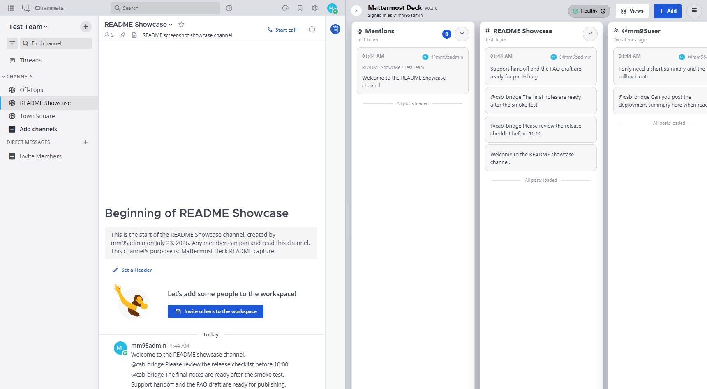
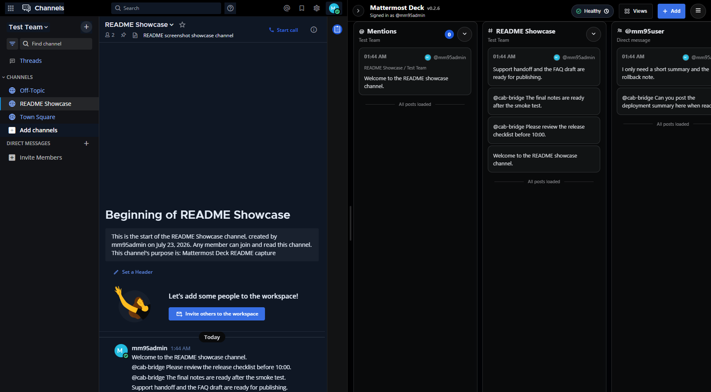

# Mattermost Deck

[English README](./README.md)

Mattermost Deck は、Mattermost Web の右側に TweetDeck 風のマルチペイン UI を追加する Chrome 拡張です。ログイン、投稿、編集、チーム移動、スレッド表示といった主要操作は Mattermost 本体をそのまま使い、Deck は監視と一覧性に特化した補助 UI として動作します。

## スクリーンショット

ライトテーマ:



ダークテーマ:



## 主な機能

- リサイズ可能な右側 Deck と横スクロール型ペイン
- 次のペイン種別に対応
  - `mentions`
  - `channelWatch`
  - `dmWatch`
  - `keywordWatch`
  - `search`
  - `saved`
  - `diagnostics`
- Views メニューから保存済みペインセットを切り替え
- レイアウトの JSON エクスポート / インポート
- Mattermost PAT を使った任意のリアルタイム更新
- 同一 Mattermost サーバー向けの設定を切り替えるプロファイル機能
- Mattermost テーマ追従、ペイン識別カラー、コンパクト表示、幅設定
- 投稿本文の URL 検出と長い文字列の省略表示
- 日本語、英語、ドイツ語、中国語簡体字、フランス語 UI

## 動作概要

- 拡張は Shadow DOM 上に右レールを描画します
- REST API は現在のブラウザセッションを再利用します
- PAT を設定すると WebSocket でリアルタイム差分を受信します
- 描画は次の条件を満たすときだけ有効になります
  - 設定済み Mattermost origin と一致
  - 許可された route kind 上にいる
  - 任意設定の team slug 条件に一致
  - health-check API が成功

## セットアップ

```powershell
npm install
npm run build
```

Chrome で `dist/` を「パッケージ化されていない拡張機能」として読み込んでください。

初回は Options 画面が開きます。おすすめの順序は次のとおりです。

1. `Connection` を開く
2. `Mattermost Server URL` を保存する
3. 必要なら `Team Slug`、PAT、polling、見た目設定を追加する
4. `Profiles` は接続が動いてから必要な場合だけ使う

Server URL を保存すると、その Mattermost origin に対する Chrome 権限確認が表示されます。拡張は設定済みの Mattermost サーバーにだけ注入されます。

## 設定画面

### Connection

- Mattermost Server URL
- 任意の Team Slug 制限
- Allowed route kinds
- Health-check API path

### Profiles

- origin ごとの任意設定セット
- プロファイルの作成、改名、複製、切替、削除
- Ops 用、Support 用のように同一サーバーで設定を分けたい場合を想定

### Realtime

- WebSocket 更新用 Personal Access Token
- PAT の session 保存 / persistent 保存
- realtime 無効時の polling 間隔

### Appearance

- テーマ
- 言語
- フォント倍率
- レール幅
- カラム幅
- コンパクト表示
- 画像プレビュー
- ペイン識別カラー

### Behavior

- 投稿クリック時の動作
- Highlight Keywords
- High Z-index
- 投稿順の反転

## セキュリティ

- PAT 保存の既定値は `chrome.storage.session`
- 永続保存は明示的な opt-in
- 永続保存 PAT はクライアント側で暗号化して保存
- health-check path は設定済み origin 配下の `/api/v4/...` に制限
- 複数ペイン更新時の REST バーストを避けるため、タブ内で直列化して実行

## 開発

```powershell
npm run build
npm run test
```

補助コマンド:

```powershell
npm run check
npm run test:e2e
npm run mm95:start
npm run mm95:stop
npm run open:mattermost
npm run capture:readme
```

`test:e2e` とスクリーンショット更新には、接続可能な Mattermost テスト環境が必要です。

## リリース

`v0.1.0` のような `v` 形式タグを push すると GitHub Actions が起動します。

- `npm ci`, `npm run check`, `npm run build` を実行
- `dist/` を `mattermost-deck-<tag>.zip` として生成
- GitHub Release を作成して zip を添付

## ライセンス

MIT。詳細は [LICENSE](./LICENSE) を参照してください。

## 翻訳追加

ロケールファイルは `src/ui/locales/` にあります。新しい言語を追加する場合は:

1. `en.json` をコピーして新しい locale ファイルを作成
2. `src/ui/i18n.ts` に登録
3. `src/ui/settings.ts` の `DeckLanguage` と `normaliseLanguage` に追加
4. `src/options/index.tsx` の言語選択肢に追加

## 設計メモ

- English design guide: [./docs/design-guidelines.md](./docs/design-guidelines.md)
- 日本語設計ガイド: [./docs/design-guidelines.ja.md](./docs/design-guidelines.ja.md)
