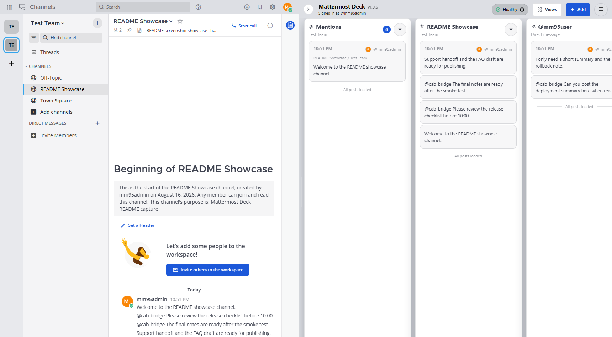
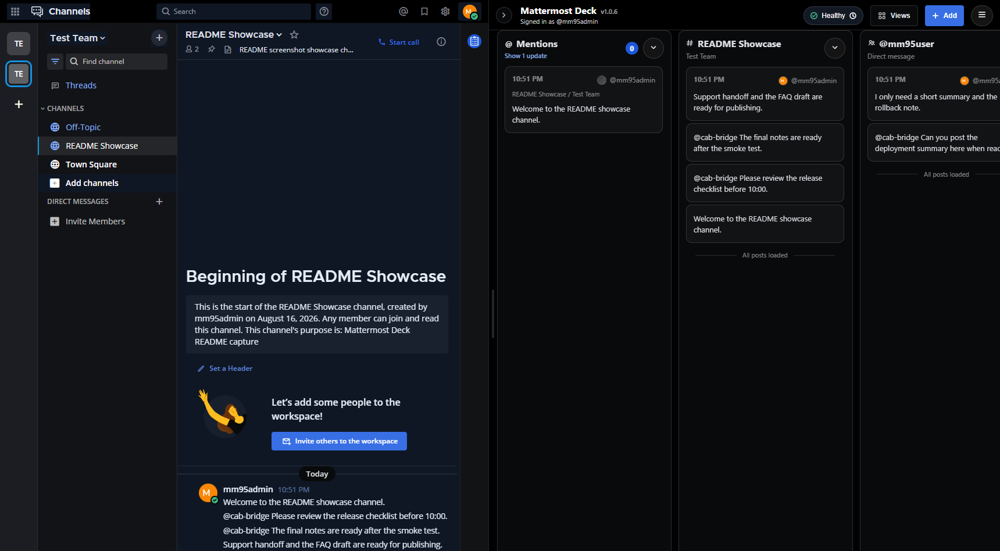

# Mattermost Deck

[日本語 README](./README.ja.md)

Mattermost Deck is a Chrome extension that adds a monitoring-oriented multi-pane workspace to the right side of Mattermost Web while keeping Mattermost itself as the primary UI for login, posting, editing, navigation, and threads.

[Install Mattermost Deck from the Chrome Web Store](https://chromewebstore.google.com/detail/mattermost-deck/imbnblgiedelpebcfkenbhomcibomdpi)

## Public Website

The Mattermost Deck introduction and legal pages are published with Cloudflare Pages:

- Website: https://mattermost-deck.ruhenheim.org/
- Privacy Policy: https://mattermost-deck.ruhenheim.org/privacy/
- Terms of Use: https://mattermost-deck.ruhenheim.org/terms/

The static site lives in `docs/`. The workflow in
`.github/workflows/cloudflare-pages.yml` validates and deploys it to the
Cloudflare Pages project named `mattermost-deck` after site changes reach
`main`. The repository must define `CLOUDFLARE_ACCOUNT_ID` and a
least-privilege `CLOUDFLARE_API_TOKEN` with Cloudflare Pages edit access.

## Screenshots

Light theme:



Dark theme:



## Features

- Resizable right-side deck that gives a Mattermost right pane, such as a thread, search results, or pinned posts, its full measured width by shrinking Deck by the same amount; it collapses to a 52 px rail when less than 280 px would remain, then restores the requested width and scroll position. An explicit manual resize may expand Deck while keeping at least 320 px of Mattermost visible; automatic preferred sizing reserves 720 px.
- Pane types:
  - `mentions`
  - `channelWatch`
  - `dmWatch`
  - `keywordWatch` (legacy layout-import compatibility; new keyword workflows use a search pane plus highlighting)
  - `search`
  - `saved`
  - `diagnostics`
- Saved pane sets from the Views menu
- Layout export and import as JSON
- Optional realtime updates with a Mattermost PAT
- Mattermost-aligned mention collection across teams and joined channels, including custom mention keys, group and special mentions, CRT and non-CRT thread semantics, and DM/GM conversations
- Optional per-server profiles for switching between multiple saved setting sets
- Mattermost-aware theme colors, optional pane identity accents, configurable default widths, and a compact mode that switches to dense `time author: content` rows with stable per-author colors
- Inline URL detection and truncation for long tokens in post bodies
- Jump-to-latest floating control for long panes
- Reply post indicator and reply-aware navigation that opens standalone replies in Mattermost thread view
- Diagnostics pane with lightweight recent sync hints, plus a Performance tab with API endpoint summary, recent trace logs, and JSONL export
- Japanese, English, German, Chinese (Simplified), French, Russian, Ukrainian, Spanish, and Korean UI
- Localized extension package name and description for Chrome
- Direct links from Settings to the official website, privacy policy, terms, support, and Chrome Web Store listing

## How It Works

- The extension mounts a Shadow DOM right rail and reserves width from the Mattermost page.
- REST requests reuse the active browser session.
- Optional WebSocket mode uses a PAT configured in Options.
- Rendering is guarded by:
  - configured Mattermost origin
  - allowed route kinds
  - optional team slug restriction
  - health-check API success

## Setup

```powershell
npm install
npm run build
```

Load `dist/` as an unpacked extension in Chrome.

On first install, Chrome opens the Options page. The recommended setup order is:

1. Open `Connection`
2. Save `Mattermost Server URL`
3. Optionally set `Team Slug`, PAT, polling, and appearance settings
4. Use `Profiles` only after the server connection is working

Saving the server URL requests Chrome permission for that Mattermost origin. The extension injects only into configured Mattermost servers.
Remote servers must use HTTPS; HTTP remains available only for localhost and loopback development. Mattermost Site URLs that include a subpath are supported.

## Compatibility

- Google Chrome version 120 or later
- The full Docker-backed E2E suite runs on Mattermost 9.5.4
- Every pull request and release also gates core route, team-switch, thread-layout, and responsive behavior on Mattermost 9.5.11, 10.11.22, and 11.8.2

Other Mattermost patch releases and Chromium-based browsers are not part of the release-gated support matrix. Validate the extension in a staging environment before deploying it to a business-critical Mattermost instance.

## Options Overview

### Connection

- Mattermost Server URL
- Optional Team Slug restriction
- Allowed route kinds
- Health-check API path

### Profiles

- Optional per-origin setting sets
- Create, rename, duplicate, switch, and delete profiles
- Intended for multiple workflows on the same Mattermost server, such as Ops and Support

### Realtime

- Personal Access Token for WebSocket updates
- Session-only or persistent PAT storage
- Polling interval when realtime is disabled

### Appearance

- Theme
- Language
- Font scale
- Preferred rail width
- Preferred column width
- Compact mode
  - compact mode removes cards and uses a dense single-line layout like `time author: content`
  - your own author name uses the theme accent color and other authors use stable per-user colors
  - regular mode keeps the standard layout and only tightens nearby posts from the same person
- Image previews
- Pane identity color accents

### Behavior

- Post click action
  - replies open via permalink/thread view so posts that exist only inside a thread can still be shown reliably in Mattermost
- Highlight keywords
- High Z-index mode
- Reverse post order

### Performance

- Trace capture toggle for detailed troubleshooting
- API endpoint summary with request count, latency, and error rate
- Recent trace log table with full request URL, status, duration, and queue wait
- JSONL export for offline analysis
- Diagnostics keeps a shortened recent sync log for day-to-day use; the detailed request table remains in Performance
- Activity-based retention policy:
  - turning trace capture off clears stored logs
  - entries older than 24 hours are pruned the next time the extension runs, writes a trace, or opens diagnostics

## Security Notes

- PAT storage defaults to `chrome.storage.session`
- Persistent PAT storage is opt-in
- Persistent PAT values are encrypted client-side before storage
- Health-check paths are restricted to relative `/api/v4/...` paths under the configured Mattermost Site URL
- REST requests are serialized in-tab and heavier fan-out paths are batched to avoid burst refresh behavior when many panes update together
- After an empty state has been shown once, background refresh keeps that empty state visible instead of flashing a loading spinner

## Development

```powershell
npm run build
npm run test
```

Useful additional commands:

```powershell
npm run check
npm run check:release
npm run check:site
npm run test:e2e
npm run test:soak
npm run mm95:start
node scripts/mm95-start.mjs --version 11.8.2
npm run mm95:stop
npm run open:mattermost
npm run capture:readme
```

`mm95:start` starts Mattermost 9.5.4 by default; use the versioned command above to exercise another supported major version. `test:e2e` and screenshot capture require a reachable Mattermost test environment.
`test:soak` runs the isolated 20-minute, fixed-seed layout memory soak. It creates and later deletes 384 Mattermost test posts, keeps a large search result set loaded while cycling native right-pane surfaces and viewport widths, applies tens of thousands of allocation-bounded RHS mutations, and writes bounded heap, DOM, listener, User Timing, and layout-measurement trends under `test-results/`. Set `MM_DECK_SOAK_MINUTES` (10–120) or `MM_DECK_SOAK_SEED` before running to override the duration or seed. Use `test:soak:auto-adjust-off` to isolate automatic layout observation or `test:soak:control` to run the same Mattermost workload without the extension.
`open:mattermost` closes its browser when the launcher exits and limits unattended sessions to eight hours by default. Set `MM95_BROWSER_MAX_LIFETIME_MINUTES` to another non-negative minute value, or `0` to disable the lifetime limit.

## Release

Push a tag in `v` format, such as `v1.0.6`, to trigger GitHub Actions. The release job rejects tags that do not match the versions recorded in the package, manifest, in-app source, website, and changelog.

- Runs type checks, unit tests, the full Mattermost 9.5.4 Playwright suite, and the release compatibility matrix for 9.5.11, 10.11.22, and 11.8.2
- Builds the Chrome Web Store archive with `STORE_BUILD=true`, extracts that exact archive, and smoke-tests its ungranted first-run state and safe handling when Chrome cannot approve the native permission prompt
- Packages `dist/` as `mattermost-deck-<tag>.zip`
- Creates a SHA-256 checksum and uploads both the zip and checksum to the GitHub Release

For a local release build on PowerShell:

```powershell
npm ci
npm run check
npm test
npm run build
npm run mm95:start
try { npm run test:e2e } finally { npm run mm95:stop }
$env:STORE_BUILD = "true"
$env:EXT_VERSION = "v1.0.6"
npm run build
npm run check:store
Compress-Archive -Path dist\* -DestinationPath mattermost-deck-v1.0.6.zip -Force
```

The archive must contain `manifest.json` at its root. Store builds intentionally omit the localhost-only static content script; local development builds retain it for E2E testing.

Before uploading to Chrome Web Store, load the extracted release archive as an unpacked extension in Chrome, save the test Mattermost URL, approve Chrome's native host-permission prompt, and confirm that Deck appears only on that configured origin. The headless release smoke test verifies the exact archive's initially ungranted state and safe denial path without falsely pre-granting permission. Approval of Chrome's native prompt and the resulting Deck injection remain a required visible manual release check; the normal development E2E suite separately covers permitted injection behavior.

Use [Chrome Web Store submission copy](./docs/chrome-web-store-submission.md) when maintaining the listing, privacy declarations, and permission justifications.

## License

MIT. See [LICENSE](./LICENSE).

## Contributing Translations

UI locale files live in `src/ui/locales/`. Extension package locale files live in `src/_locales/`.

To add a new UI language:

1. Copy `src/ui/locales/en.json` to a new file such as `ko.json` and translate it. Plural keys must carry exactly the CLDR categories the language requires (`Intl.PluralRules(<code>).resolvedOptions().pluralCategories`), which is enforced by `src/ui/locales.test.ts`.
2. Add an entry to `SUPPORTED_LANGUAGES` in `src/ui/language.ts`. The Settings language picker and the store build locale gate are derived from it.
3. Register the resource in `src/ui/i18n.ts`
4. Add the `options.language<Code>` label to every locale file
5. Add the language to `src/popup/messages.ts` and `src/pwa-install/installGuide.ts`

To localize the extension package metadata, add a matching `src/_locales/<chromeLocale>/messages.json`. `appDescription` must stay within 132 characters, which the build enforces.

## Design Notes

- English design guide: [./docs/design-guidelines.md](./docs/design-guidelines.md)
- Japanese design guide: [./docs/design-guidelines.ja.md](./docs/design-guidelines.ja.md)
